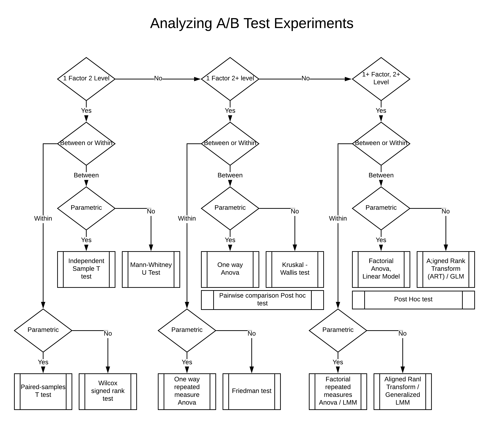

```{r setup, include=FALSE}
knitr::opts_chunk$set(echo = TRUE)
library(car)
library(coin)
library(plyr)
library(tidyverse)
library(MASS)
library(multcomp)
library(PMCMR)
library(PMCMRplus)
library(lsmeans)
library(ARTool) # for art, artlm
library(nnet)
```


## Common distributions 

* Normal: Most common for distribution, commonly called a Bell curve. 
* Log normal: Time taken to complete a task
* Exponential distributions : Wealth
* Poisson: Count data such as counts of rare events. This is only integer response.
* Binomial distribution: Coin toss 
* Power law distribution: Distribution of friends in a social network
* Beta distribution

----

## Parametric Vs Non parametric tests  

* Parametric assume a distribution of data such a Normal, exponential, Poisson etc.
* Non parametric tests do not make those assumptions. They typically work by comparing the rank of each item in a variant with each item in the other variants 

----

## General workflow 
```{r , echo=FALSE,  out.width = '100%'}

```

----

### Factor 2 Level test: Independent Sample T Test 

Example: You are launching a new design for Apollo home, and you want to see if that has an impact on user retention. There is only one redesign (one variant) and you will be comparing that with existing home page.

#### Background: 

* Lets call the new redesign as "New" and old design as "Old"
* You have done your due diligence and selected a metric that will track retention. Lets call this metric as App logins in the next 11 days 
* You have done your sample size calculations and decided to send 50% of new users to the new design and 50% to the older design 

#### Analysis

Descriptive test

* Summary statistics such as mean, median, quantile etc.
* Plot the distribution / histogram of the response variable
* Plot box plots
* Visual examination of the plots

* Do you think the responses look different
    + Run statistical test 

#### Read input file 

```{r }
## Independent-samples t-test

# read in a data file with page views from an A/B test
logins11Day = read.csv("logins11Day.csv")
head(logins11Day)
logins11Day$Site = factor(logins11Day$Site) # convert to nominal factor
summary(logins11Day)
```

#### Run descriptive statistics
```{r}
# descriptive statistics by Site

ddply(logins11Day, ~ Site, function(data) summary(data$Logins))
ddply(logins11Day, ~ Site, summarise, Pages.mean=mean(Logins), Pages.sd=sd(Logins))

```

#### Plot distribution of data 

* Notice that the distribution for the second graph is not quite normal 
    + We will ignore this for now, and revisit this in the next example 
    
```{r}
# graph histograms and a boxplot
hist(logins11Day[logins11Day$Site == "Old",]$Logins, 
     main = "Histogram of Logins on Old Site")
hist(logins11Day[logins11Day$Site == "New",]$Logins, 
     main = "Histogram of Logins on New Site")
plot(Logins ~ Site, data=logins11Day)
```


#### Run t-test 

* We are running the default t-test assuming that variances are equal 
    + I am highlighting this example because this is not a prescribed way of running t-tests
    + We have not checked any Anova assumptions

```{r}
# independent-samples t-test
t.test(Logins ~ Site, data=logins11Day, var.equal=TRUE)
```

Test says that the 2 groups are __different__, but can we trust it ?

------


### T-test done the right way : 1 Factor 2 Level test

Example: You have assigned users tasks (say completion of a survey or a time taken to complete an adventure) and you want to see if there is a difference between time taken each for task variant 

Background: 

* Let us compare the time taken to complete 2 tasks and call these task 1 and task 2. This is similar to the experiment in the previous example. We will add more tasks later. 
* For now just consider 1 factor, 2 variant test 
* You have done your sample size calculations and decided to send 50% of new users to task 1 and 50% to task 2

__Import data__ 

```{r}
# read in a data file with task completion times (min) for 2 different tasks 
anova1 = read.csv("anova1.csv")
head(anova1)
anova1$Subject = as.factor(anova1$Subject) # convert to nominal factor
anova1$TASK = as.factor(anova1$TASK) # convert to nominal factor
summary(anova1)


```

__Run descriptive tests__

_Summary stats sugggest that time taken to complete the 2 tasks is different_

```{r}
# view descriptive statistics by TASK

ddply(anova1, ~ TASK, function(data) summary(data$Time))
ddply(anova1, ~ TASK, summarise, Time.mean=mean(Time), Time.sd=sd(Time))

```

__Graph histograms and box plots__

_Histogram of the data is not really normal_
```{r}
# graph histograms and a boxplot
hist(anova1[anova1$TASK == "Task1",]$Time, 
     main = "Histogram of Time to complete Task 1") # histogram
hist(anova1[anova1$TASK == "Task2",]$Time, 
     main = "Histogram of Time to complete Task 2") # histogram
```

_Box plots suggest that there may be a difference between time taken_
```{r}
#head(anova1)
glimpse(anova1)


plot(Time ~ as.factor(TASK), data=anova1) # boxplot
```

__Running an independent-samples t-test is not suitable because we have not tested Anova assumptions__

__Testing ANOVA assumptions__

* We will use Shapiro Wilk test to test assumptions for normality
   
```{r}    
# Shapiro-Wilk normality test on response
shapiro.test(anova1[anova1$TASK == "Task1",]$Time)
shapiro.test(anova1[anova1$TASK == "Task2",]$Time) 
```
Notice that the P values are less than 5% for both test. This means that Time is not normally distributed.
We have violated the first assumption for Anova that the data should be normally distributed 

__Really what we are looking for is that the residuals are normally distributed__

```{r}    
m = aov(Time ~ TASK, data=anova1) # fit model
shapiro.test(residuals(m)) # test residuals
```

We can also plot the qq plot to see if the residuals are normally distributed 

```{r}    
qqnorm(residuals(m)); 
qqline(residuals(m)) # plot residuals
```

_qq plot show that the data is not normally distributed_

__Since the residuals are not normally distributed, you have 2 options__

* Use data transformations to make data normal and use parametric tests 
* Use a non parametric test. Non parametric tests do not assume a distribution 

__Continuing with a parametric test__

```
Typically when one is looking at task completion times, lognormal is a good candidate distribution to start.
Intutive reasoning behind using a log normal distribution is that the "Log Normal" is the log of the 
normal distribution.
When users are asked to complete a task, majority will complete it with a certain time and a 
small minority will take much longer to complete the same task. That distribution generally follows a 
log normal distribution.
If log normal does not work, other distribution to try would be a poisson distribution, or a beta distribution 
```

**_T Test and Anova are generally robust and will work even if the data in not quite normal_**

* Kolmogorov-Smirnov test for log-normality
* Fit the distribution to a lognormal to estimate fit parameters
* Then supply those to a K-S test with the lognormal distribution fn

```{r} 


fit = fitdistr(anova1[anova1$TASK == "Task1",]$Time, "lognormal")$estimate #Fit a lognormal distribution
ks.test(anova1[anova1$TASK == "Task1",]$Time, "plnorm", meanlog=fit[1], sdlog=fit[2], exact=TRUE) # Test for goodness of fit

fit = fitdistr(anova1[anova1$TASK == "Task2",]$Time, "lognormal")$estimate #Fit a lognormal distribution
ks.test(anova1[anova1$TASK == "Task2",]$Time, "plnorm", meanlog=fit[1], sdlog=fit[2], exact=TRUE) # Test for goodness of fit

```

P values greater than 5% indicates that the new fit does not violate the log normal assumptions

__Testing for the 2nd Anova assumption: Homoscedasticity (homogeneity of variance)__

``` 
Homogeneity of variance means that the variance does not increase as the size of the variable increases 
It is mostly seen in time series where the value in the this time period depends on value in the previous 
time period. In that case, errors from previous value get added to the current value and compounded. 
Other places where you would see that is where the relationship with the dependent variable is logarithimic 
In those cases, box-cox transformation can help you alleviate heteroscedasticity  
```
__A recommended and a generic approach is to use GLM models and specify the distributiosn while modeling the data__

__We will touch on GLM models later in the document__

```{r} 
# tests for homoscedasticity (homogeneity of variance)

leveneTest(Time ~ TASK, data=anova1, center=mean) # Levene's test
leveneTest(Time ~ TASK, data=anova1, center=median) # Brown-Forsythe test
```

We run tests for both Mean and Median. 
Since the P value is less than 5%, this suggests that it does not satisfy homogeneity of variance assumption

**_You can use Welch's T test if the homoscedasticity assumption is violated_**

```{r}
# Welch t-test for unequal variances handles
# the violation of homoscedasticity. but not
# the violation of normality.
t.test(Time ~ TASK, data=anova1, var.equal=FALSE) # Welch t-test

```

__Running the T test again, after controlling for Anova assumptions__

Steps
* Transform variables 
* Test for normailty 
* Test for homoscedasticity
* Run appropriate T test 

Data transformation 

```{r}
# create a new column in anova1 defined as log(Time)
anova1$logTime = log(anova1$Time) # log transform
head(anova1) # verify
```

Visually examine transformed data 
```{r}
hist(anova1[anova1$TASK == "Task1",]$logTime, 
     main = "Histogram of log(Time) to complete Task 1") # histogram # histogram
hist(anova1[anova1$TASK == "Task2",]$logTime, 
     main = "Histogram of log(Time) to complete Task 2") # histogram

plot(logTime ~ as.factor(TASK), data=anova1) # boxplot
```

Re-test for normality

```{r}
shapiro.test(anova1[anova1$TASK == "Task1",]$logTime)
shapiro.test(anova1[anova1$TASK == "Task2",]$logTime)
```

Re-test for normality of residuals 

```{r}
m = aov(logTime ~ TASK, data=anova1) # fit model
shapiro.test(residuals(m)) # test residuals
```

Visually examine residuals 
```{r}
qqnorm(residuals(m)); qqline(residuals(m)) # plot residuals
```

Re-test for homoscedasticity

```{r}

leveneTest(logTime ~ TASK, data=anova1, center=median) # Brown-Forsythe test
```

__Finally: Independent-samples t-test (now suitable for logTime)__

```{r}
t.test(logTime ~ TASK, data=anova1, var.equal=TRUE)
```

**Running a non-parametric test**

_If the underlying distribution is not normal, and none of the transformations that you have tried to make the data normal seem to work, it is time to run a non-paramteric test_

```
Non paramteric tests, do not assume an underlying distribution
Instead, they compare compare and rank each row element is the first 
group with other row elemets in second group. 

When reporting results for non-parametric tests, you should report the median 
and not the mean 
```

```{r}
wilcox_test(Time ~ as.factor(TASK), data=anova1, distribution="exact")
wilcox_test(logTime ~ as.factor(TASK), data=anova1, distribution="exact") # note: same result
```

__This completes the section for running a one factor two level t test__
__In the next section we explore how to run one factor multiple levels Anova test__


---

### One factor multiple levels parametric one way Anova between populations

> We will add one more task to the previous dataset so that now we are comparing 3 tasks 

__One-way ANOVA__

* Read in a data file with task completion times (min) now from 3 tasks

```{r}
anova2 = read.csv("anova2.csv")
head(anova2)
anova2$TASK = factor(anova2$TASK) # convert to nominal factor
summary(anova2)
```

* View descriptive statistics by TASK

```{r}

ddply(anova2, ~ TASK, function(data) summary(data$Time))
ddply(anova2, ~ TASK, summarise, Time.mean=mean(Time), Time.sd=sd(Time))
```

* Explore new response distribution

```{r}
hist(anova2[anova2$TASK == "Task1",]$Time, 
     main = "Histogram of Time to complete Task 1") # histogram
hist(anova2[anova2$TASK == "Task2",]$Time, 
     main = "Histogram of Time to complete Task 2") # histogram
hist(anova2[anova2$TASK == "Task3",]$Time, 
     main = "Histogram of Time to complete Task 3") # histogram # new one
#plot(Time ~ TASK, data=anova2) # boxplot
```

* Test normality for new TASK

```{r}
shapiro.test(anova2[anova2$TASK == "Task3",]$Time)
m = aov(Time ~ TASK, data=anova2) # fit model
shapiro.test(residuals(m)) # test residuals
qqnorm(residuals(m)); qqline(residuals(m)) # plot residuals
```

* Test log-normality of new TASK

```{r}

fit = fitdistr(anova2[anova2$TASK == "Task3",]$Time, "lognormal")$estimate
ks.test(anova2[anova2$TASK == "Task3",]$Time, "plnorm", meanlog=fit[1], sdlog=fit[2], exact=TRUE) # lognormality

```

* Compute new log(Time) column and re-test

```{r}
anova2$logTime = log(anova2$Time) # add new column
head(anova2) # verify
shapiro.test(anova2[anova2$TASK == "Task3",]$logTime)
m = aov(logTime ~ TASK, data=anova2) # fit model
shapiro.test(residuals(m)) # test residuals
qqnorm(residuals(m)); qqline(residuals(m)) # plot residuals
```

* Test homoscedasticity

```{r}

leveneTest(logTime ~ TASK, data=anova2, center=median) # Brown-Forsythe test
```

**_One-way ANOVA, suitable now to logTime_**

```{r}
m = aov(logTime ~ TASK, data=anova2) # fit model
anova(m) # report anova
```

```
How to analyze the output?
What is a F score?
```

**_Results of  Anova tell us that atleast one of the task time is different than the rest, however it does not tell which task time is different_**

> Next step is to do a pair-wise comparison of task times

```{r}
plot(Time ~ TASK, data=anova2) # for convenience
```
```{r}
summary(glht(m, mcp(TASK="Tukey")), test=adjusted(type="holm")) # Tukey means compare all pairs
# adjusted(type="holm") is a corection applied while doing a pairwise comparison 
```


* Task2 is different from Task1 and Task3
* Task1 and Task3 are similar

#### Non parametric anova 

```{r}
# Kruskal-Wallis test
PMCMRplus::kwAllPairsConoverTest(Time ~ as.factor(TASK), data=anova2, distribution="asymptotic") # can't do exact with 3 levels
PMCMRplus::kwAllPairsConoverTest(logTime ~ as.factor(TASK), data=anova2, distribution="asymptotic") # note: same result
# for reporting Kruskal-Wallis as chi-square, we can get N with nrow(anova2)

# manual post hoc Mann-Whitney U pairwise comparisons
# note: wilcox_test we used above doesn't take two data vectors, so use wilcox.test
vs.ec = wilcox.test(anova2[anova2$TASK == "Task1",]$Time, anova2[anova2$TASK == "Task2",]$Time, exact=FALSE)
vs.py = wilcox.test(anova2[anova2$TASK == "Task1",]$Time, anova2[anova2$TASK == "Task3",]$Time, exact=FALSE)
ec.py = wilcox.test(anova2[anova2$TASK == "Task2",]$Time, anova2[anova2$TASK == "Task3",]$Time, exact=FALSE)
p.adjust(c(vs.ec$p.value, vs.py$p.value, ec.py$p.value), method="holm")

# alternative approach is using PMCMR for nonparam pairwise comparisons

#posthoc.kruskal.conover.test(Time ~ TASK, data=anova2, p.adjust.method="holm") # deprecated
PMCMRplus::kwAllPairsConoverTest(Time ~ TASK, data=anova2, p.adjust.method="holm") # Conover & Iman (1979)

```


### Factorial Anova (Crossed factor design)

> Suppose you want to understand the impact of pricing on retention for exiting users. Also, you want to test it across different user engagement levels


---

* There are 3 pricing levels - low (7.99) , medium (10.99) and high (12.99)
* There are 2 levels of user engagement for existing users - low and high. For this example, we assume the engagement levels definition is already established 

---

_Note: If you wanted to run an experiment that includes new users also, that would just be a separate "One factor [Price]  multiple levels [low, medium and high] one way Anova test between populations", since we don't yet know the engagement level of new users_


__What questions are you trying to answer__

* Does pricing affect retention ?
* Does user engagement level affect retention ?
* Is there an interaction affect between pricing and user engagment level? For example: Are highly engaged users insensitive to price?


```{r  message=FALSE}

pricing = read.csv("pricing.csv")
pricing$Engagement  <- factor( pricing$Engagement , levels = c("Low","High"))
pricing$Price <- factor( pricing$Price , levels = c("Low (7.99)","Medium (9.99)","High (12.99)"))

head(pricing)
str(pricing)
summary(pricing)

ddply(pricing, ~ Engagement * Price, function(data) summary(data$Days))
ddply(pricing, ~ Engagement * Price, summarise, Days.mean=mean(Days), Days.sd=sd(Days))

ggplot(data = pricing[pricing$Engagement == "High" & pricing$Price == "Low (7.99)",], aes(x=Days) ) + geom_histogram() + 
  labs(title = "Histogram of unique app logins in 1st week after signup", subtitle = "Engagement = High & Price = Low (7.99) ")

ggplot(data = pricing[pricing$Engagement == "High" & pricing$Price == "Medium (9.99)",], aes(x=Days) ) + geom_histogram() + 
  labs(title = "Histogram of unique app logins in 1st week after signup", subtitle = "Engagement = High & Price = Medium (10.99) ")

ggplot(data = pricing[pricing$Engagement == "High" & pricing$Price == "High (12.99)",], aes(x=Days) ) + geom_histogram() + 
  labs(title = "Histogram of unique app logins in 1st week after signup", subtitle = "Engagement = High & Price = High (12.99) ")

ggplot(data = pricing[pricing$Engagement == "Low" & pricing$Price == "Low (7.99)",], aes(x=Days) ) + geom_histogram() + 
  labs(title = "Histogram of unique app logins in 1st week after signup", subtitle = "Engagement = Low & Price = Low (7.99) ")

ggplot(data = pricing[pricing$Engagement == "Low" & pricing$Price == "Medium (9.99)",], aes(x=Days) ) + geom_histogram() + 
  labs(title = "Histogram of unique app logins in 1st week after signup", subtitle = "Engagement = Low & Price = Medium (10.99) ")

ggplot(data = pricing[pricing$Engagement == "Low" & pricing$Price == "High (12.99)",], aes(x=Days) ) + geom_histogram() + 
  labs(title = "Histogram of unique app logins in 1st week after signup", subtitle = "Engagement = Low & Price = High (12.99) ")

boxplot(Days ~ Engagement , data=pricing, xlab="Engagement", ylab="Days") # boxplots
boxplot(Days ~  Price, data=pricing, xlab="Price", ylab="Days") # boxplots

ggplot(data = pricing ) + geom_boxplot(aes(x=Price, y = Days , color = Engagement)) + 
  labs(title = "Boxplot for unique app logins for price and user engagement")

with(pricing, interaction.plot(Price, Engagement, Days, ylim=c(0, max(pricing$Days)))) # interaction plot

model = lm(Days ~ Price + Engagement + Price:Engagement,
           data=pricing)

Anova(model, type="II") 

hist(residuals(model), col="darkgray")

shapiro.test(residuals(model))

lsmeans(model, pairwise ~ Engagement, adjust="tukey")
lsmeans(model, pairwise ~ Price, adjust="tukey")
lsmeans(model, pairwise ~ Engagement:Price, adjust="tukey")
```


#### Factorial Anova (Crossed factor design): Non parametric test 

Now we run the above test using a non-parametic approach 

```
Note: Non parametric tests typically suffer from Type 1 error for interaction terms
```


```{r  message=FALSE}
model = art(Days ~ Price * Engagement, data=pricing) # uses LMM
anova(model)

#Omnibus test 

for (engagement in c("High","Low") ) {
  #print(str_c("engagement = " ,engagement ))
  if ( engagement == "High") {
    highly_engaged_7.99_9.99 <- (wilcox.test(pricing[pricing$Price == "Low (7.99)" & pricing$Engagement == engagement,]$Days, pricing[pricing$Price == "Medium (9.99)" & pricing$Engagement == engagement,]$Days, paired=FALSE))
    highly_engaged_7.99_12.99 <-  (wilcox.test(pricing[pricing$Price == "Low (7.99)" & pricing$Engagement == engagement,]$Days, pricing[pricing$Price == "High (12.99)" & pricing$Engagement == engagement,]$Days, paired=FALSE))
    highly_engaged_7.99_12.99 <- (wilcox.test(pricing[pricing$Price == "High (12.99)" & pricing$Engagement == engagement,]$Days, pricing[pricing$Price == "Medium (9.99)" & pricing$Engagement == engagement,]$Days, paired=FALSE))
  }
  
  if ( engagement == "Low") {
    low_engaged_7.99_9.99 <- (wilcox.test(pricing[pricing$Price == "Low (7.99)" & pricing$Engagement == engagement,]$Days, pricing[pricing$Price == "Medium (9.99)" & pricing$Engagement == engagement,]$Days, paired=FALSE))
    low_engaged_7.99_12.99 <-  (wilcox.test(pricing[pricing$Price == "Low (7.99)" & pricing$Engagement == engagement,]$Days, pricing[pricing$Price == "High (12.99)" & pricing$Engagement == engagement,]$Days, paired=FALSE))
    low_engaged_7.99_12.99 <- (wilcox.test(pricing[pricing$Price == "High (12.99)" & pricing$Engagement == engagement,]$Days, pricing[pricing$Price == "Medium (9.99)" & pricing$Engagement == engagement,]$Days, paired=FALSE))
  }
  
}

p.adjust(c(highly_engaged_7.99_9.99$p.value, highly_engaged_7.99_12.99$p.value, highly_engaged_7.99_12.99$p.value, low_engaged_7.99_9.99$p.value, low_engaged_7.99_12.99$p.value , low_engaged_7.99_12.99$p.value), method="holm")

```
----

### Generalized Linear Models 

Generalized Linear Models (GLM) extend Linear Models (LM) for studies with between factors to acommodate nominal (incl. binomial) or ordinal responses, or with non-normal response distributions (e.g., Poisson, exponential, gamma). All GLMs have a distribution and a link fn relating  their factors to their response.
The GLM generalizes the LM, which is a  GLM with a normal distribution and "identity" link fn. See, e.g., http://en.wikipedia.org/wiki/Generalized_linear_model


Case study: Analyze user preference by Sex with multinomial logistic regression

Data: Table with user_id (Subject), Design preference (Pref) and Sex (M|F)

Questions to answer 
* Do users prefer one design over the other 
* Is the preference different by Gender 

```{r}
prefsABCsex.2 = read.csv("prefsABCsex.csv") # revisiting so add ".2"
head(prefsABCsex.2)
prefsABCsex.2$Subject = factor(prefsABCsex.2$Subject) # convert to nominal factor
prefsABCsex.2$Sex = as.factor(prefsABCsex.2$Sex)
summary(prefsABCsex.2)
plot(as.factor(prefsABCsex.2[prefsABCsex.2$Sex == "M",]$Pref))
plot(as.factor(prefsABCsex.2[prefsABCsex.2$Sex == "F",]$Pref))
```

```{r message=FALSE, warning=FALSE}
# set sum-to-zero contrasts for the Anova call
contrasts(prefsABCsex.2$Sex) <- "contr.sum"
m = multinom(Pref ~ Sex, data=prefsABCsex.2) # multinomial logistic
Anova(m, type=3) # note: not "anova" from stats pkg
# note: if Pref had only had two response categories, we might use 
# binomial regression, which uses the same syntax as Poisson regression 
# below, but with family=binomial.
```

* Anova test shows that the preferences are different.
* Next steps is to do a pairwise comparsion to understand the difference in preference for males 


```{r message=FALSE, warning=FALSE}
ma = binom.test(sum(prefsABCsex.2[prefsABCsex.2$Sex == "M",]$Pref == "A"), nrow(prefsABCsex.2[prefsABCsex.2$Sex == "M",]), p=1/3)
mb = binom.test(sum(prefsABCsex.2[prefsABCsex.2$Sex == "M",]$Pref == "B"), nrow(prefsABCsex.2[prefsABCsex.2$Sex == "M",]), p=1/3)
mc = binom.test(sum(prefsABCsex.2[prefsABCsex.2$Sex == "M",]$Pref == "C"), nrow(prefsABCsex.2[prefsABCsex.2$Sex == "M",]), p=1/3)
p.adjust(c(ma$p.value, mb$p.value, mc$p.value), method="holm") # correct for multiple comparisons
```

Males preferred C over A and B

* Understanding the difference in preference for females

```{r message=FALSE, warning=FALSE}
fa = binom.test(sum(prefsABCsex.2[prefsABCsex.2$Sex == "F",]$Pref == "A"), nrow(prefsABCsex.2[prefsABCsex.2$Sex == "F",]), p=1/3)
fb = binom.test(sum(prefsABCsex.2[prefsABCsex.2$Sex == "F",]$Pref == "B"), nrow(prefsABCsex.2[prefsABCsex.2$Sex == "F",]), p=1/3)
fc = binom.test(sum(prefsABCsex.2[prefsABCsex.2$Sex == "F",]$Pref == "C"), nrow(prefsABCsex.2[prefsABCsex.2$Sex == "F",]), p=1/3)
p.adjust(c(fa$p.value, fb$p.value, fc$p.value), method="holm") # correct for multiple comparisons

```

Females do not prefer A 

----

##### Using GLM for poisson distributed data 

__When the underlying data does not follow a normal distribution __

Previously, we had run Anova tests on Normally distributed data 
Using GLM, you can run Anova on data that is not normally distributed 

In the example below, we will be looking at eror count data that follows a poisson distribution 

Case study: You have rolled 2 different versions of the user profile page and you want to see how many users have errors entering their details on the page. We will compare results of the 2 new versions with the existing version 

```
Poisson distribution is widely seen for count data. 

The Poisson distribution may be useful to model events such as
* The number of meteorites greater than 1 meter diameter that strike Earth in a year
* The number of patients arriving in an emergency room between 10 and 11 pm
* In a laser the number of photons hitting a detector in a particular time interval will follow Poisson distribution.

In our example, poisson is a candidate distribution because 
* Errors are discrete 
* We assume that occurrence of one error does not affect the probability that a second error will occur
* Users cannot make 2 errors at the same time 

https://en.wikipedia.org/wiki/Poisson_distribution
```

```{r message=FALSE, warning=FALSE}
error_count <- read.csv("error_count.csv")
error_count$Design <- factor(error_count$Design, levels=c("Orig","New1","New2"))

ddply(error_count, ~ Design, function(data) summary(data$Errors))
ddply(error_count, ~ Design, summarise, Errors.mean=mean(Errors), Errors.sd=sd(Errors))
hist(error_count[error_count$Design == "Orig",]$Errors)
hist(error_count[error_count$Design == "New1",]$Errors)
hist(error_count[error_count$Design == "New2",]$Errors)
plot(Errors ~ Design, data=error_count) # boxplot

# re-verify that these data are Poisson-distributed
library(fitdistrplus)
fit = fitdist(error_count[error_count$Design == "Orig",]$Errors, "pois", discrete=TRUE)
gofstat(fit) # goodness-of-fit test
fit = fitdist(error_count[error_count$Design == "New1",]$Errors, "pois", discrete=TRUE)
gofstat(fit) # goodness-of-fit test
fit = fitdist(error_count[error_count$Design == "New2",]$Errors, "pois", discrete=TRUE)
gofstat(fit) # goodness-of-fit test

# analyze using Poisson regression
# set sum-to-zero contrasts for the Anova call
contrasts(error_count$Design) <- "contr.sum"
# family parameter identifies both distribution and link fn
m = glm(Errors ~ Design, data=error_count, family=poisson)
Anova(m, type=3)
qqnorm(residuals(m)); qqline(residuals(m)) # s'ok! Poisson regression makes no normality assumption

# conduct pairwise comparisons among levels of Design
library(multcomp)
summary(glht(m, mcp(Design="Tukey")), test=adjusted(type="holm")) # Tukey means compare all pairs

```


